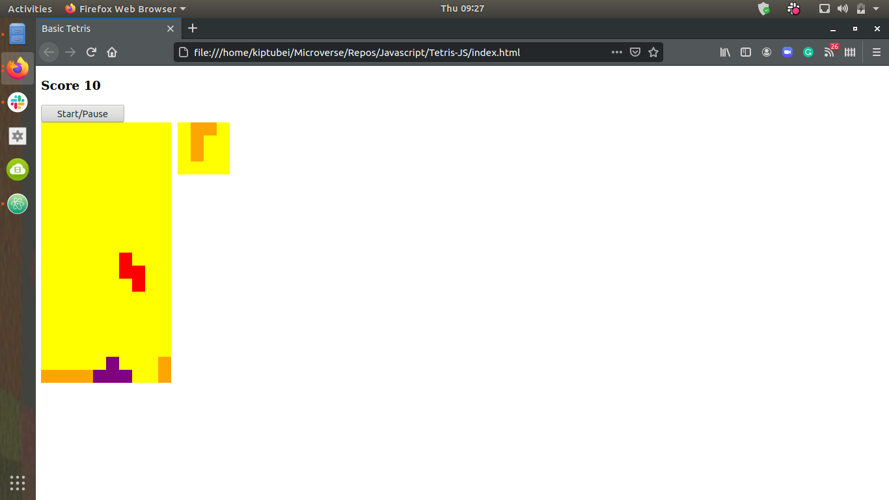

# Tetris-JS (JavaScript)

This project is a basic version of the popular Tetris game built entirely in Javascript.


## Live Demo


## ScreenShoot



## Built With

- JavaScript
- ESLint
- Atom

## Prerequisites

You must have a browser on your PC in order to use the application. [Click here](https://www.mozilla.org/en-US/firefox/new/) to download one.

## Getting Started

1. clone the project

```bash
# Clone this repository
$ git clone https://github.com/kiptubei/Tetris-JS.git

# Go into the repository
$ cd Tetris-JS

# start the app
Copy the absolute path of the index file, paste on your browser and click on enter
```

## for webpack run:

```bash
Not implemented
```

## Usage

- open index.html in root folder
- click on start button to start the game
- left arrow key, to move left
- right arrow key, to move right
- up arrow key ,to rotate shape

## Authors

👤 **Mark Kiptubei**

- [Github](https://github.com/kiptubei)
- [Twitter](https://twitter.com/mjabei)
- [Linkedin](https://www.linkedin.com/in/kiptubei/)

## 🤝 Contributing

Contributions, issues and feature requests are welcome!

Feel free to check the <a href="https://github.com/kiptubei/Tetris-JS/issues" target="_blank">issues page</a>.

## Show your support

Give a ⭐️ if you like this project!

## Acknowledgments

- <a href="https://www.theodinproject.com/" target="_blank">The Odin Project</a>
